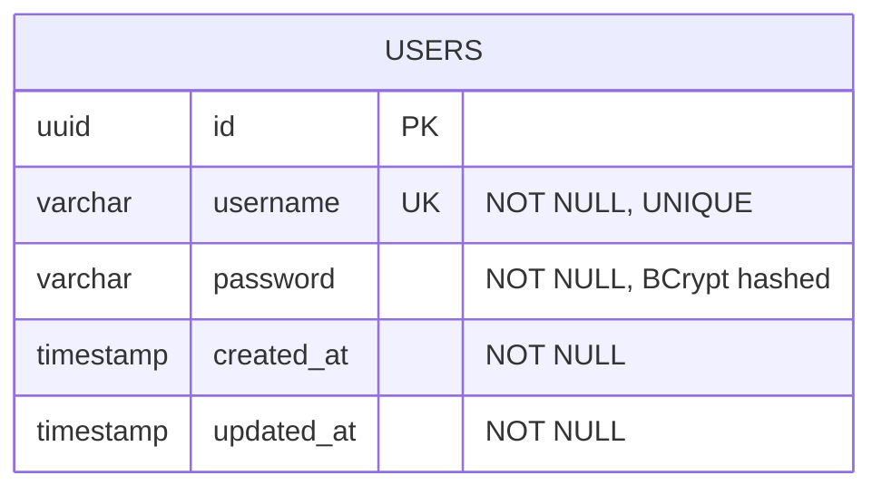
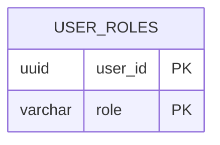
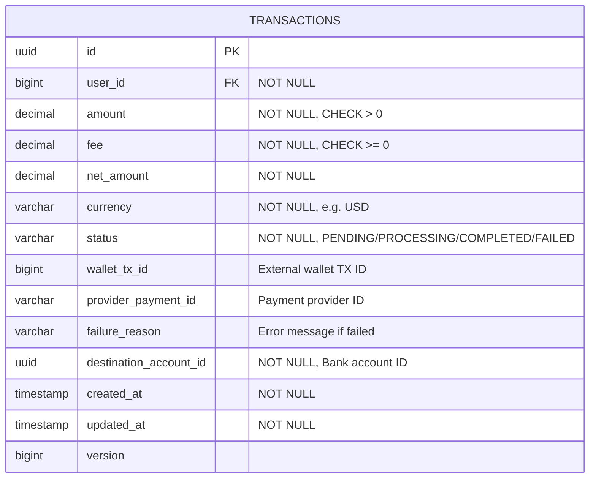
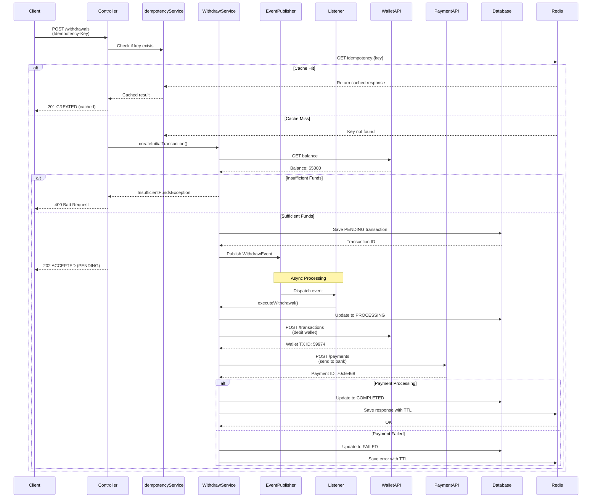
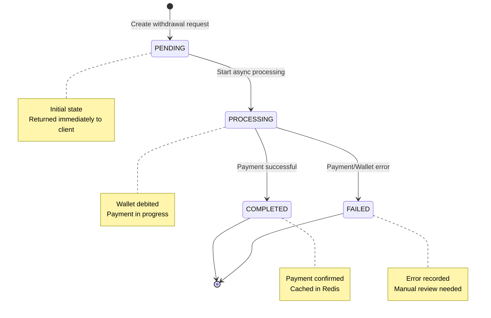
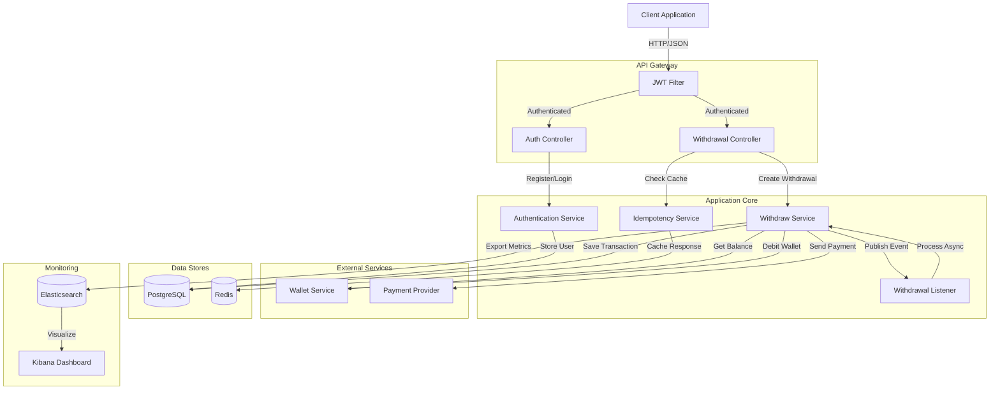
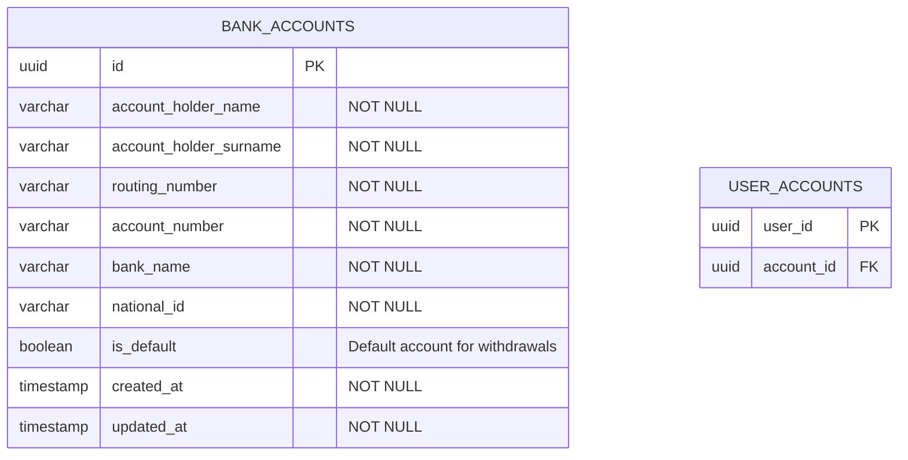
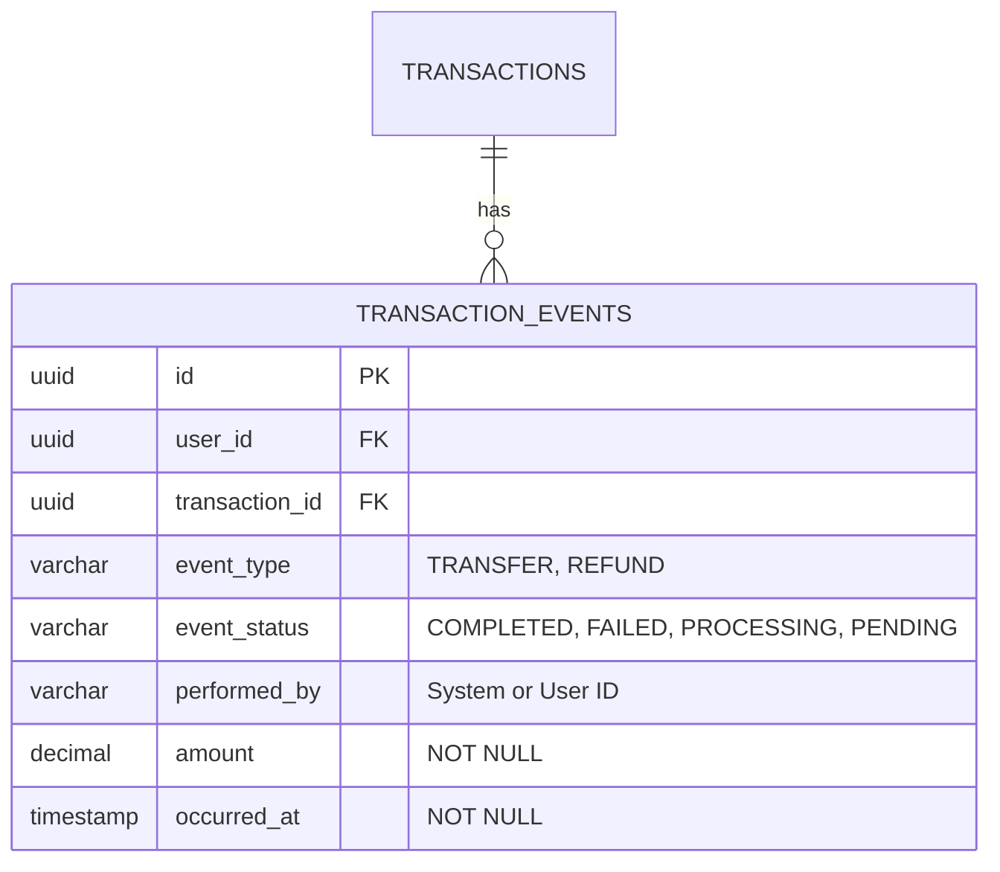

# Ontop Challenge - Wallet Withdrawal System

A secure, scalable microservice for processing wallet withdrawals with external payment integration, built with Spring Boot and hexagonal architecture principles.

## 🎯 Overview

This system enables users to withdraw funds from their wallet to their bank account. The application:
- Validates user balance before processing
- Calculates and deducts a 10% transaction fee
- Debits the user's wallet
- Initiates bank transfer via external payment provider
- Handles idempotency using Redis
- Tracks transaction status throughout the process
- Provides comprehensive monitoring with Micrometer + Elasticsearch

### Key Features

✅ **Secure Authentication**: JWT-based authentication with BCrypt password hashing  
✅ **Cached Idempotent Operations**: Redis-backed idempotency keys prevent duplicate transactions  
✅ **Asynchronous Processing**: Event-driven architecture for non-blocking operations  
✅ **Resilience Patterns**: Circuit breakers and retry mechanisms with Resilience4j  
✅ **Comprehensive Monitoring**: Metrics exported to Elasticsearch/Kibana  
✅ **Production-Ready**: Docker support, health checks, and structured logging  

---

## 🏗️ Architecture

### Detailed Flow Description

#### Phase 1: Request Validation (Synchronous)
1. Client sends withdrawal request with `Idempotency-Key` header and auth header
2. JWT authentication filter validates the token
3. Controller validates request body
4. Check Redis for existing response with same idempotency key
5. If found, return cached response immediately (201 CREATED)

#### Phase 2: Transaction Creation (Synchronous)
6. Query wallet service for current balance
7. Calculate fee (10%) and net amount
8. Verify sufficient funds (amount ≤ balance)
9. Create PENDING transaction in database
10. Return 202 ACCEPTED immediately to client

#### Phase 3: Background Processing (Asynchronous)
11. Publish an event
12. `WithdrawalListener` picks up event asynchronously
13. Update transaction status to PROCESSING
14. Debit user wallet via external API
15. Send payment to bank via payment provider
16. Update transaction status to COMPLETED or FAILED
17. Cache final response in Redis with TTL

#### Phase 4: Idempotency Check (Subsequent Requests)
18. Same idempotency key returns cached result from Redis
19. No duplicate processing occurs

---

## 📝 API Documentation

### Authentication Endpoints

- `POST /api/v1/auth/register` - Register new user and get JWT token
- `POST /api/v1/auth/login` - Login and get JWT token

### Withdrawal Endpoints

- `POST /api/v1/withdrawals` - Create withdrawal (requires auth + idempotency key)

### Actuator Endpoints

- `GET /actuator/health` - Health check
- `GET /actuator/metrics` - All metrics
- `GET /actuator/metrics/{name}` - Specific metric

---

## 🚀 Getting Started

### Prerequisites

- **Java 21** or higher
- **Docker** and **Docker Compose**

### Option 1: Run with Docker (Recommended)

```bash
# Start all services (app + database + redis + elasticsearch + kibana)
docker-compose up --build

# Wait for services to be healthy (~60 seconds)
# Application will be available at http://localhost:8080
```

### Option 2: Run Locally

```bash
# 1. Start infrastructure services only
docker-compose up postgres redis elasticsearch -d

# 2. Build the application
./gradlew clean build

# 3. Run the application
./gradlew bootRun

# Or run the JAR directly
java -jar build/libs/challenge-0.0.1-SNAPSHOT.jar
```

### Access UIs

- **API**: http://localhost:8080
- **Kibana**: http://localhost:5601 (metrics visualization)
- **pgAdmin**: http://localhost:8081 (email: admin@ontop.com, password: admin)

---

## 🧪 Running Tests

```bash
# Run all tests
./gradlew test

# Run specific test class
./gradlew test --tests WithdrawServiceTest
```

---

## 🧪 Testing the Endpoints

Import the API collection: `./Test-API.postman_collection.json`

---

## 📊 Monitoring

### Kibana Dashboards

1. Access Kibana: http://localhost:5601
2. Create Data View: `ds-metrics-ontop-*`
3. View metrics in Discover

---

## 🔒 Security

- **Authentication**: JWT with HS256 signing
- **Password**: BCrypt hashing
- **XSS Prevention**: OWASP Java Encoder
- **Rate Limiting**: Bucket4j (future enhancement)

---

## 🛠️ Technologies

### Core Stack
- **Java 21** - Latest LTS with modern language features
- **Spring Boot 3.5.6** - Application framework
- **PostgreSQL 18** - Primary database
- **Redis 7** - Caching and idempotency management
- **Gradle** - Build tool

### Key Libraries
- **Spring Security + JWT** - Authentication and authorization
- **Spring Data JPA + Hibernate** - ORM and database access
- **Flyway** - Database migrations
- **Resilience4j** - Circuit breaker, retry
- **Micrometer + Elasticsearch** - Metrics and monitoring
- **Lombok** - Boilerplate reduction

### Infrastructure
- **Docker & Docker Compose** - Containerization
- **Elasticsearch + Kibana** - Metrics visualization

---

## 💾 Database Schemas

### Users Table



### User_roles Table



### TRANSACTIONS Table



## Diagrams

### Transaction Execution Sequence Diagram



### Transaction Status Flow



### Component Diagram



---

## 📁 Project Structure

```
src/
├── main/
│   ├── java/com/ontop/challenge/
│   │   ├── adapters/
│   │   │   ├── in/                    # REST Controllers & DTOs
│   │   │   │   ├── dto/
│   │   │   │   ├── AuthenticationController.java
│   │   │   │   ├── WithdrawalController.java
│   │   │   │   └── GlobalExceptionHandler.java
│   │   │   └── out/                   # External integrations
│   │   │       ├── client/            # HTTP clients
│   │   │       │   ├── WalletClientAdapter.java
│   │   │       │   └── PaymentsClientAdapter.java
│   │   │       └── persistence/       # JPA repositories
│   │   │           ├── entity/
│   │   │           ├── mapper/
│   │   │           └── TransactionRepositoryAdapter.java
│   │   ├── application/
│   │   │   ├── exception/             # Custom exceptions
│   │   │   ├── port/                  # Interface definitions
│   │   │   │   ├── in/
│   │   │   │   └── out/
│   │   │   └── service/               # Business logic
│   │   │       ├── WithdrawService.java
│   │   │       ├── AuthenticationService.java
│   │   │       ├── IdempotencyService.java
│   │   │       └── WithdrawalListener.java
│   │   ├── domain/                    # Domain entities
│   │   │   ├── Transaction.java
│   │   │   ├── TransactionStatus.java
│   │   │   └── User.java
│   │   ├── infrastructure/
│   │   │   ├── config/                # Configuration
│   │   │   └── security/              # Security setup
│   │   └── ChallengeApplication.java
│   └── resources/
│       ├── application.yaml           # Configuration
│       └── db/migration/              # Flyway scripts
└── test/                              # Unit & Integration tests
```

---

## Future Features (Design Only)

### 2. Account Management

**Design Overview**: Allow users to save multiple bank accounts and select one for each withdrawal.

#### Database Schema



#### API Endpoints Design

##### 1. **Create Bank Account**
```http
POST /api/v1/account
Authorization: Bearer {jwt_token}
Content-Type: application/json

{
  "user_id": "uuidxyz"
  "accountHolderName": "John",
  "accountHolderSurname": "xyz"
  "routing_number": "1234567890"
  "accountNumber": "1234567890",
  "bankName": "Xyz Bank",
  "nationalId": "123-45-6789",
  "isDefault": true
}
```

**Response (201 Created):**
```json
{
  "id": "550e8400-e29b-41d4-a716-446655440000",
  "user_id": "uuidxyz",
  "accountHolderName": "John Doe",
  "routingNumber": "021000021",
  "bankName": "Chase Bank",
  "isDefault": true,
  "createdAt": "2025-10-24T10:30:00Z"
}
```

##### 2. **List User's Bank Accounts**
```http
GET /api/v1/accounts/{userId} 
Authorization: Bearer {jwt_token}
```

**Response (200 OK):**
```json
{
  "accounts": [
    {
      "id": "550e8400-e29b-41d4-a716-446655440000",
      "accountHolderName": "John",
      "routingNumber": "021000021",
      "bankName": "LaLa Bank",
      "isDefault": true,
      "lastUsedAt": "2025-10-23T15:45:00Z",
      "createdAt": "2025-10-20T10:30:00Z"
    },
    {
      "id": "660e8400-e29b-41d4-a716-446655440001",
      "accountHolderName": "John",
      "routingNumber": "011401533",
      "bankName": "Pato Bank",
      "isDefault": false,
      "lastUsedAt": "2025-10-15T09:20:00Z",
      "createdAt": "2025-10-15T08:00:00Z"
    }
  ],
  "total": 2
}
```

##### 3. **Get Single Bank Account**
```http
GET /api/v1/accounts/{userId}/{accountId}
Authorization: Bearer {jwt_token}
```

##### 4. **Update Bank Account**
```http
PUT /api/v1/accounts/{userId}/{accountId}
Authorization: Bearer {jwt_token}
Content-Type: application/json

{
  "accountNickname": "Primary Checking",
  "isDefault": true
}
```

**Note**: For security, sensitive fields (account number, national ID, routing number) cannot be updated. User must delete and recreate.

##### 5. **Delete Bank Account**
```http
DELETE /api/v1/accounts/{userId}/{accountId}
Authorization: Bearer {jwt_token}
```

**Response (200 OK):**
```json
{
  "message": "Bank account deleted successfully",
  "accountId": "550e8400-e29b-41d4-a716-446655440000"
}
```

##### 6. **Set Default Account**
```http
POST /api/v1/accounts/{userId}/{accountId}/set-default
Authorization: Bearer {jwt_token}
```

#### Security Measures

1. **Encryption at Rest**
    - `account_number`: encrypted
    - `national_id`: encrypted

2. **Data Access Controls**
    - User can only access their own accounts
    - Role-based access: `USER` can CRUD their accounts, `ADMIN` can view all (audit)

4. **Validation Rules**
    - **Account Number**: 4-17 digits
    - **National ID**: Format validation based on country (SSN: XXX-XX-XXXX)
    - **Account Holder Name**: Match authenticated user's name

5. **Rate Limiting**
    - Max 5 accounts per user
    - Max 3 account creation requests per hour
    - Max 10 failed verification attempts

#### Withdrawal Integration

**Updated Withdrawal Request:**
```http
POST /api/v1/withdrawals
Authorization: Bearer {jwt_token}
Idempotency-Key: {unique-key}
Content-Type: application/json

{
  "userId": 1000,
  "destinationAccountId": "550e8400-e29b-41d4-a716-446655440000",
  "amount": 1000.00,
  "currency": "USD"
}
```

**Business Rules:**
- If `destinationAccountId` not provided, use default account
- Account must belong to authenticated user
- Update `last_used_at` timestamp after successful withdrawal
- User call the endpoint to create the account
  - Check if the req body userId is the same user as the one extracted from jwt 
  - Account is created both ON BANK_ACCOUNTS table and USER_ACCOUNTS table
- List all accounts can be used in a page where user can see all the accounts where he can update/delete/set as default.

---

### 3. Transaction History

**Design Overview**: Provide comprehensive transaction history with filtering and pagination.

#### Database schema



#### API Endpoints Design

##### 1. **List Transactions with Filters**
```http
GET /api/v1/transactions/{userId}?page=0&size=20&status=COMPLETED&startDate=2025-10-01&endDate=2025-10-31&accountId={accountId}&sortBy=createdAt&sortOrder=DESC
Authorization: Bearer {jwt_token}
```

**Query Parameters:**

| Parameter   | Type     | Required | Description                   | Example                                        |
|-------------|----------|----------|-------------------------------|------------------------------------------------|
| `page`      | integer  | No       | Page number (0-indexed)       | `0`                                            |
| `size`      | integer  | No       | Items per page (max 100)      | `20`                                           |
| `status`    | enum     | No       | Filter by status              | `COMPLETED`, `FAILED`, `PENDING`, `PROCESSING` |
| `startDate` | ISO-8601 | No       | Start date (inclusive)        | `2025-10-01T00:00:00Z`                         |
| `endDate`   | ISO-8601 | No       | End date (inclusive)          | `2025-10-31T23:59:59Z`                         |
| `accountId` | UUID     | No       | Filter by destination account | `550e8400-...`                                 |
| `minAmount` | decimal  | No       | Minimum transaction amount    | `100.00`                                       |
| `maxAmount` | decimal  | No       | Maximum transaction amount    | `5000.00`                                      |
| `sortBy`    | string   | No       | Sort field                    | `createdAt`, `amount`, `status`                |
| `sortOrder` | enum     | No       | Sort direction                | `ASC`, `DESC`                                  |

**Response (200 OK):**
```json
{
  "transactions": [
    {
      "transactionId": "550e8400-e29b-41d4-a716-446655440000",
      "userId": 1000,
      "amount": 1000.00,
      "fee": 100.00,
      "netAmount": 900.00,
      "currency": "USD",
      "status": "COMPLETED",
      "destinationAccount": {
        "id": "660e8400-e29b-41d4-a716-446655440001",
        "bankName": "LaLa Bank"
      },
      "walletTxId": 59974,
      "providerPaymentId": "70cfe468",
      "createdAt": "2025-10-24T10:30:00Z",
      "updatedAt": "2025-10-24T10:30:15Z"
    },
    {
      "transactionId": "660e8400-e29b-41d4-a716-446655440002",
      "userId": 1000,
      "amount": 500.00,
      "fee": 50.00,
      "netAmount": 450.00,
      "currency": "USD",
      "status": "FAILED",
      "destinationAccount": {
        "id": "770e8400-e29b-41d4-a716-446655440003",
        "bankName": "PAto Bank"
      },
      "failureReason": "Payment provider rejected transaction: Invalid routing number",
      "createdAt": "2025-10-23T15:45:00Z",
      "updatedAt": "2025-10-23T15:45:10Z"
    }
  ],
  "pagination": {
    "currentPage": 0,
    "pageSize": 20,
    "totalPages": 5,
    "totalElements": 87,
    "hasNext": true,
    "hasPrevious": false
  },
  "summary": {
    "totalAmount": 45000.00,
    "totalFees": 4500.00,
    "totalNetAmount": 40500.00,
    "completedCount": 82,
    "failedCount": 3,
    "pendingCount": 2
  }
}
```

#### Database Indexes for Performance

```sql
-- Composite indexes for common query patterns
CREATE INDEX idx_transactions_user_created ON transacion_events(user_id, created_at DESC);
CREATE INDEX idx_transactions_user_status ON transacion_events(user_id, status);
CREATE INDEX idx_transactions_created_status ON transacion_events(created_at DESC, status);
```

#### Caching Strategy

1. **Redis Cache for Transactions**
   ```
   Key: transactions:user:{userId}
   TTL: optional (probably I wont add it)
   Value: Last X transactions
   ```
When the transacion_events table is updated for one user that already have a key in the redis, 
the cache for this user is invalidated and when fetching the history again it will get from the DB and update the cache.

#### Authorization Rules

- **USER Role**: Can only view their own transactions
- **ADMIN Role**: Can view all users' transactions (with audit logging)

#### Performance Considerations

1. **Pagination**: Enforce maximum page size of 100
2. **Date Range**: Limit to 1 year maximum per query
3. **Read Replicas**: Route read-heavy queries to replicas

**Business Rules:**
- When the withdrawal endpoint is called and the transaction have the status as completed, it saves the transaction
on the transaction_events table.
